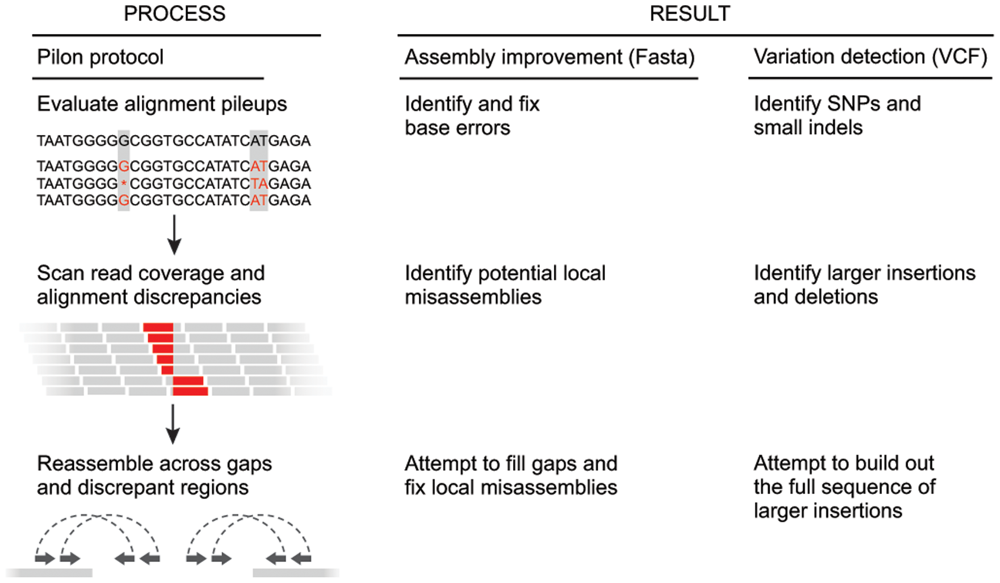

## First, we convert our read maps to a different file format

bwa outputs what are called SAM files. The SAM file, is a tab-delimited text file that contains information for each individual read and its alignment to the genome.

The compressed binary version of SAM is called a BAM file. We use this version to reduce size and to allow for indexing, which enables efficient random access of the data contained within the file. This will compress our SAM file by about 3 fold.

The file begins with a header, which is optional. The header is used to describe source of data, reference sequence, method of alignment, etc., this will change depending on the aligner being used. Following the header is the alignment section. Each line that follows corresponds to alignment information for a single read. Each alignment line has 11 mandatory fields for essential mapping information and a variable number of other fields for aligner specific information. An example entry from a SAM file is displayed below with the different fields highlighted.

We're going to switch over to using sambamba 

```unix
wget https://github.com/biod/sambamba/releases/download/v0.6.6/sambamba_v0.6.6_linux.tar.bz2
tar xvf sambamba_v0.6.6_linux.tar.bz2
```

Make a copy of the bwa_map script we ran Tuesday. Rename the run and the output file. Delete the script. We  will put several lines into the script. This next bit is slightly choose your own adventure.

If you concatenated all the fastq: 

```
samtools view -S -@ 20 -b mega.sam > mega.bam
```

If you made a bunch of SAM files: 
```
for file in *.sam
do
samtools view -S -@ 20 -b $file > $file.bam 
done


samtools merge output.bam input.bam ... inputN.bam 
```

Both of these will take about an hour.

Then we sort and index them. Add the below to your script. Double check paths to files:

```
/work/amwright/sambamba_v0.6.6 sort -o sorted.bam -p -t 20 mega.bam
samtools index -@ 20 mega.sorted.bam
```

The step of sorting them sorts the reads according to where they map in the assembly (i.e., reads that map to scaffolds closer togther will be closer in the file). Indexing allows for viewing of the files (more on this Tuesday), and is required by Pilon.

## Pilon



Pileups - the reads that align to part of the assembly. Use this info (depth, sequence) to:


1. Confirm the assembly sequence: the vast majority of evidence supports the base in the input genome;
2. Change the assembly sequence: the vast majority of evidence supports a change of the base in the input genome to another allele;
3. Ambiguous: the evidence supports more than one alternative at this position;
4. Unconfirmed: there is insufficient evidence to make a determination at this position due to insufficient depth of coverage by valid reads.

The pileups are also used to find small indels. For instance, if the input genome has the sequence ACCCCT, but the read evidence suggests one of the Cs should be deleted (ACCCT), each individual read alignment might show a deletion at any of the four C coordinates.

### Using Pilon

Create another script file by copying either the bwa\_map script or sam\_command script. Rename the run and the output. Delete the actual commands. Replace them with:

```
  java -Xmx120G -jar /work/yourUseName/pilon-1.21.jar --genome data/assembled/Illumina_assembly.fasta --outdir data/  --changes --tracks --diploid --frags data/mega.sorted.bam > illumina-pilon.log
```

### Homework 

[Pilon options](https://github.com/broadinstitute/pilon/wiki/Requirements-&-Usage) are here.

Choose one other factor that you think might affect the assembly. Use pilon to make improvements to that issue. For example, you might consider eliminating low quality bases. Alternatively, you might choose to eliminate something from the fix list.

Make either a separate script, or add you pilon command to the qsub we started in class. Push to your copy of the course website, or email to me.

## References

[Pilon](http://journals.plos.org/plosone/article?id=10.1371/journal.pone.0112963#s5) 

[Data Carpentry Genomics lesson](http://www.datacarpentry.org/wrangling-genomics/02-variant_calling/)


