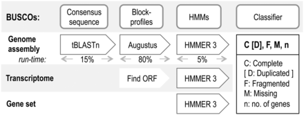

We've now made a couple of assemblies, and improved them in a few ways with Pilon. But how can we know if one assembly is 'better' than another? What relevant data might we collect?

Clean up data directories. 

Some common numbers are as follows:

| Measure | Meaning | 
|---------|---------|
| Number of contigs | How many contigs were constructed from reads |
| Largest contigs | Size in BP of largest contig constructed from reads |
| N50 | Median Weighted contig size |
| Per-base error rate | Estimated errors expected per base pair |


These are a lot of technical benchmarks. We might also be interested in  biological or evolutionary statistics. For this, the clownfish paper authors used  Benchmarking Universal Single-Copy Orthologs (BUSCO). 

BUSCO is a software for using known, annotated alignments to assess how complete the assembly is. BUSCO uses the data in [OrthoDB](http://www.orthodb.org/). OrthDB is a database of known orthologous, protein-coding genes for a group.  

BUSCO ortholog sets are have been quantified in several major lineages.  The BUSCO set contains genes that:

+ Are single-copy
+ Present in 90% of the genomes in that group

For fish, there are 4585 described genes. If you add all the gene numbers in Table 1 of the clownfish paper, this is the total you will get. 



Hidden Markov Model: A Markov model in which one or more states are assumed to be invisible to the observer.

In the clownfish_data directory, create a 'busco' directory in the data directory. Change into it, and download the BUSCO set for Actinopterygii: 

```
wget http://busco.ezlab.org/datasets/actinopterygii_odb9.tar.gz
```

Untar it. 

Next, we'll install a local BLAST search:

``` 
wget https://ftp.ncbi.nlm.nih.gov/blast/executables/blast+/2.2.31/ncbi-blast-2.2.31+-x64-linux.tar.gz
```

Untar it.
Lastly, there are a couple dependencies for BUSCO:

```

wget http://eddylab.org/software/hmmer3/3.1b2/hmmer-3.1b2-linux-intel-x86_64.tar.gz
tar xvf hmmer-3.1b2-linux-intel-x86_64.tar.gz

wget http://archive.ubuntu.com/ubuntu/pool/main/z/zlib/zlib_1.2.8.dfsg.orig.tar.gz
tar xvf zlib_1.2.8.dfsg.orig.tar.gz 
cd  zlib-1.2.8/
./configure --prefix=/work/yourUserName
make

wget http://downloads.sourceforge.net/project/boost/boost/1.62.0/boost_1_62_0.tar.bz2
tar xvf boost_1_62_0.tar.bz2
cd boost_1_62_0
./bootstrap.sh --prefix=/work/yourUserName --with-libraries=iostreams
./b2

wget http://bioinf.uni-greifswald.de/augustus/binaries/augustus-3.3.tar.gz
tar xvf augustus-3.3.tar.gz
cd augustus
make
```

Now, we'll transfer into the busco/config directory. Copy the config file that exists there to one called config.ini. We will edit some of the paths in the file together.

Next, transfer back into the clownfish_data directory. Copy one of your run scripts from a previous step, and call it "busco_command". 


In qsub: export AUGUSTUS_CONFIG_PATH=/my_path_to_AUGUSTUS/augustus/config/)

## Homework

Complete BUSCO analyses on both of your Pilon-improved genome assemblies. Add and commit the short\_summary\_busco\_annotation.txt for each of these analyses to your fork of the course github.

